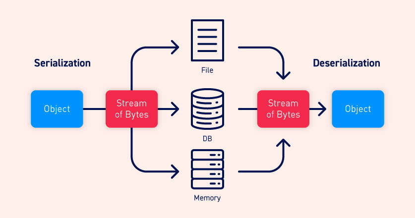

# Insecure deserialization.

## What is serialization?

- Tuần tự hóa là quá trình chuyển đổi các cấu trúc dữ liệu phức tạp, chẳng hạn như các đối tượng và trường của chúng, thành một định dạng "phẳng hơn" có thể được gửi và nhận dưới dạng một dòng byte tuần tự. Việc sắp xếp thứ tự dữ liệu phục vụ cho việc:

	+ Ghi dữ liệu phức tạp vào bộ nhớ liên quá trình, tệp hoặc cơ sở dữ liệu.
	+ Gửi dữ liệu phức tạp, chẳng hạn như qua mạng, giữa các thành phần khác nhau của ứng dụng hoặc trong lệnh gọi API.
	+ Điều quan trọng, khi tuần tự hóa một đối tượng, trạng thái của nó cũng được duy trì. Nói cách khác, các thuộc tính của đối tượng được giữ nguyên, cùng với các giá trị được gán của chúng.

### Serialization vs deserialization.

- Deserialization là quá trình khôi phục luồng byte này thành một bản sao đầy đủ chức năng của đối tượng ban đầu, ở trạng thái chính xác như khi nó được tuần tự hóa. Sau đó, logic của trang web có thể tương tác với đối tượng được deserialized này, giống như với bất kỳ đối tượng nào khác.

- Nhiều ngôn ngữ lập trình cung cấp serialization. Chính xác cách các đối tượng được tuần tự hóa phụ thuộc vào ngôn ngữ. Một số ngôn ngữ tuần tự hóa các đối tượng thành các định dạng nhị phân, trong khi những ngôn ngữ khác sử dụng các định dạng chuỗi. 

- Hãy lưu ý rằng khi làm việc với các ngôn ngữ lập trình khác nhau, serialization có thể được gọi là marshalling (Ruby) hoặc pickling (Python).

## What is insecure deserialization?

- Insecure deserialization là khi dữ liệu có thể kiểm soát của người dùng được giải mã bởi một trang web. Điều này có khả năng cho phép kẻ tấn công thao túng các đối tượng được serialization để chuyển dữ liệu có hại vào mã ứng dụng.

- Thậm chí có thể thay thế một đối tượng được serialization bằng một đối tượng thuộc một lớp hoàn toàn khác. Đáng báo động là các đối tượng của bất kỳ lớp nào có sẵn trên trang web sẽ được deserialization và khởi tạo. Vì lý do này, Insecure deserialization đôi khi được gọi là lỗ hổng "Object injection".

- Một đối tượng của một lớp không mong muốn có thể gây ra một ngoại lệ. Tuy nhiên, vào thời điểm này, thiệt hại có thể đã được thực hiện. Nhiều cuộc tấn công dựa trên deserialization được hoàn thành trước khi quá trình deserialization kết thúc. Điều này có nghĩa là bản thân quá trình deserialization có thể bắt đầu một cuộc tấn công, ngay cả khi chức năng của chính trang web không tương tác trực tiếp với đối tượng độc hại. 

## How do insecure deserialization vulnerabilities arise?

- Quá trình giải mã không an toàn thường phát sinh do người ta thiếu hiểu biết chung về mức độ nguy hiểm của dữ liệu có thể kiểm soát được bởi người dùng. Lý tưởng nhất là thông tin đầu vào của người dùng không bao giờ được giải mã hóa.

-  Các bước kiểm tra cũng có sai sót về cơ bản vì chúng dựa vào việc kiểm tra dữ liệu sau khi nó đã được giải mã hóa, trong nhiều trường hợp sẽ là quá muộn để ngăn chặn cuộc tấn công.

- Các lỗ hổng cũng có thể phát sinh vì các đối tượng được deserialization thường được cho là đáng tin cậy. Đặc biệt khi sử dụng các ngôn ngữ có định dạng tuần tự hóa nhị phân, các nhà phát triển có thể nghĩ rằng người dùng không thể đọc hoặc thao tác dữ liệu một cách hiệu quả.

- Một trang web điển hình có thể triển khai nhiều thư viện khác nhau, mỗi thư viện cũng có các phụ thuộc riêng. Điều này tạo ra một nhóm lớn các lớp và phương thức khó quản lý một cách an toàn. Vì kẻ tấn công có thể tạo các phiên bản của bất kỳ lớp nào trong số các lớp này, nên thật khó để dự đoán phương thức nào có thể được gọi trên dữ liệu độc hại. 

=> Tóm lại, có thể lập luận rằng không thể giải mã dữ liệu đầu vào không đáng tin cậy một cách an toàn.

## What is the impact of insecure deserialization?

- Tác động của insecure deserialization có thể rất nghiêm trọng vì nó cung cấp điểm vào cho bề mặt tấn công gia tăng ồ ạt. Nó cho phép kẻ tấn công sử dụng lại mã ứng dụng hiện có theo những cách có hại, dẫn đến nhiều lỗ hổng khác, thường là thực thi mã từ xa.

- Ngay cả trong những trường hợp không thể RCE, quá trình giải mã hóa không an toàn có thể dẫn đến leo thang đặc quyền, truy cập tệp tùy ý và tấn công từ chối dịch vụ.

## How to exploit insecure deserialization vulnerabilities.

- [Exploit](exploit.md)

## How to prevent insecure deserialization vulnerabilities.

Nói chung, nên tránh việc giải mã dữ liệu đầu vào của người dùng trừ khi thực sự cần thiết. Bởi mức độ nghiêm trọng cao của các hành vi khai thác mà nó có thể cho phép và khó khăn trong việc bảo vệ chống lại chúng, vượt trội hơn lợi ích trong nhiều trường hợp.

- Nếu bạn cần giải mã dữ liệu từ các nguồn không đáng tin cậy, hãy kết hợp các biện pháp mạnh mẽ để đảm bảo rằng dữ liệu không bị giả mạo. 
Ví dụ: bạn có thể triển khai chữ ký điện tử để kiểm tra tính toàn vẹn của dữ liệu. Tuy nhiên, hãy nhớ rằng bất kỳ hoạt động kiểm tra nào cũng phải diễn ra trước khi bắt đầu quá trình giải mã hóa.

- Bạn có thể tạo các phương thức tuần tự hóa lớp cụ thể của riêng mình để ít nhất bạn có thể kiểm soát trường nào được hiển thị.

- Cuối cùng, hãy nhớ rằng lỗ hổng bảo mật là việc giải mã dữ liệu đầu vào của người dùng, không phải sự hiện diện của các chuỗi xử lý dữ liệu sau đó. Đừng dựa vào việc cố gắng loại bỏ các chuỗi tiện ích mà bạn xác định được trong quá trình thử nghiệm. Việc thử tất cả chúng là không thực tế do web phụ thuộc nhiều thư viện mà hầu như chắc chắn tồn tại trên trang web của bạn. 