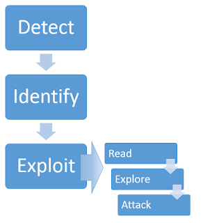

# Server-side template injection.

## What is server-side template injection?

- Template engines (công cụ giúp chúng ta tách mã HTML thành các phần nhỏ hơn mà chúng ta có thể sử dụng lại trên nhiều tập tin HTML) được sử dụng rộng rãi bởi các ứng dụng web nhằm trình bày dữ liệu thông qua các trang web và emails.

- Server-side template injection xảy ra khi những nội dung được nhập vào từ phía người dùng được nhúng không an toàn vào template ở phía máy chủ, cho phép người sử dụng có thể inject template trực tiếp. Bằng cách sử dụng các template độc hại, kẻ tấn công có thể thực thi mã tùy ý và kiểm soát hoàn toàn web server.

## What is the impact of server-side template injection?

- Các lỗ hổng SSTI có thể khiến các trang web phải đối mặt với nhiều cuộc tấn công khác nhau tùy thuộc vào công cụ mẫu được đề cập và cách ứng dụng sử dụng nó một cách chính xác. 
- Trong một số trường hợp, những lỗ hổng này không gây ra rủi ro bảo mật. Tuy nhiên, hầu hết tác động của việc tiêm mẫu phía máy chủ có thể rất nghiêm trọng.
- Kẻ tấn công có thể RCE, chiếm toàn quyền kiểm soát máy chủ back-end và sử dụng nó để thực hiện các cuộc tấn công khác vào cơ sở hạ tầng nội bộ.
- Ngay cả trong trường hợp không thể RCE, kẻ tấn công thường vẫn có thể sử dụng SSTI làm cơ sở cho nhiều cuộc tấn công khác, có khả năng đọc dữ liệu nhạy cảm và các tệp tùy ý trên máy chủ.

## How do server-side template injection vulnerabilities arise?

- Các lỗ hổng chèn mẫu phía máy chủ phát sinh khi đầu vào của người dùng được nối thành các mẫu thay vì được chuyển vào dưới dạng dữ liệu.
- VD:

> $output = $twig->render("Dear " . $GET['name']);

> http://vulnerable-website.com/?name={{bad-stuff-here}}

- Thay vì một giá trị tĩnh được truyền vào mẫu, một phần của bản thân mẫu đang được tạo động bằng cách sử dụng *name*. Vì cú pháp mẫu được máy chủ xử lí, điều này có thể cho phép kẻ tấn công đặt trọng tải SSTI bên trong *name*.

## Constructing a server-side template injection attack.



### Detect.

#### Plaintext context.

- Hầu hết các ngôn ngữ mẫu cho phép bạn tự do nhập nội dung bằng cách sử dụng các thẻ HTML trực tiếp hoặc bằng cách sử dụng cú pháp gốc của mẫu, cú pháp này sẽ được hiển thị thành HTML trên back-end trước khi phản hồi HTTP được gửi đi. 

- Điều này đôi khi có thể bị khai thác cho XSS và trên thực tế thường bị nhầm lẫn với một lỗ hổng XSS đơn giản. Tuy nhiên, bằng cách đặt các phép toán làm giá trị của tham số, chúng tôi có thể kiểm tra xem đây có phải là điểm vào tiềm năng cho một cuộc tấn công SSTI hay không.

- VD:

> render('Hello ' + username)
> http://vulnerable-website.com/?username=${7*7}
> 49 -> SSTI

#### Code context.

- Trong các trường hợp khác, lỗ hổng bảo mật bị lộ ra do thông tin của người dùng được đặt trong biểu thức mẫu.
- VD:

```
greeting = getQueryParameter('greeting')
engine.render("Hello {{"+greeting+"}}", data)
```
> http://vulnerable-website.com/?greeting=data.username
> http://vulnerable-website.com/?greeting=data.username<tag>

- Trong trường hợp không có XSS, điều này thường dẫn đến mục nhập trống trong đầu ra (chỉ Hello không có tên người dùng), thẻ được mã hóa hoặc thông báo lỗi. Bước tiếp theo là thử và thoát ra khỏi câu lệnh bằng cách sử dụng cú pháp tạo mẫu phổ biến và cố gắng chèn HTML tùy ý sau nó.

> Hello 
> http://vulnerable-website.com/?greeting=data.username}}<tag>

- Nếu điều này một lần nữa dẫn đến lỗi hoặc đầu ra trống, bạn đã sử dụng cú pháp ngôn ngữ tạo khuôn mẫu sai hoặc nếu không có cú pháp kiểu mẫu nào có vẻ hợp lệ, thì không thể thực hiện chèn mẫu phía máy chủ. Ngoài ra, nếu đầu ra được hiển thị chính xác, cùng với HTML tùy ý, thì đây là dấu hiệu chính cho thấy lỗ hổng SSTI.

> Hello Carlos<tag> 

### Identify.


### Exploit.

- [Exploit SSTI](exploit_ssti.md)

## How to prevent server-side template injection vulnerabilities.

- Cách tốt nhất để ngăn chặn việc đưa mẫu phía máy chủ vào là không cho phép bất kỳ người dùng nào sửa đổi hoặc gửi các mẫu mới.

- Sử dụng các template "no logic" (Mustache). Tách logic khỏi bản trình bày càng nhiều càng tốt có thể làm giảm đáng kể khả năng tiếp xúc của bạn với các cuộc tấn công dựa trên mẫu nguy hiểm nhất.

- Một biện pháp khác là chỉ thực thi mã của người dùng trong môi trường sandbox nơi các mô-đun và chức năng nguy hiểm tiềm ẩn đã bị loại bỏ hoàn toàn.
