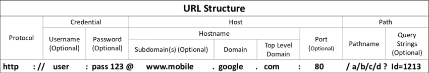

# Server-side request forgery (SSRF).

## What is SSRF?

- Server-side request forgery (SSRF), là một lỗ hổng trong đó kẻ tấn công có thể khiến máy chủ thực hiện các yêu cầu mạng ngoài ý muốn. SSRF tương tự như CSRF với một điểm khác biệt, trong khi nạn nhân của cuộc tấn công CSRF là người dùng, nạn nhân của SSRF là chính trang web.

- Kẻ tấn công có thể khiến máy chủ tạo kết nối với các dịch vụ chỉ dành cho nội bộ trong cơ sở hạ tầng của tổ chức. Trong các trường hợp khác, chúng có thể buộc máy chủ kết nối với các hệ thống bên ngoài tùy ý, có khả năng làm rò rỉ dữ liệu nhạy cảm như thông tin xác thực ủy quyền. 

## What is the impact of SSRF attacks?

- Một cuộc tấn công SSRF thành công thường có thể dẫn đến các hành động hoặc truy cập trái phép vào dữ liệu trong tổ chức, trong chính ứng dụng hoặc trên các hệ thống back-end khác mà ứng dụng có thể giao tiếp. Trong một số tình huống, lỗ hổng SSRF có thể cho phép kẻ tấn công thực hiện lệnh tùy ý.

- Việc khai thác SSRF gây ra kết nối với các hệ thống của bên thứ ba có thể dẫn đến các cuộc tấn công nguy hiểm bắt nguồn từ tổ chức lưu trữ ứng dụng dễ bị tấn công.

## Common SSRF attacks.

- Các cuộc tấn công SSRF thường khai thác các mối quan hệ tin cậy để leo thang một cuộc tấn công từ ứng dụng dễ bị tấn công và thực hiện các hành động trái phép. 
- Các mối quan hệ tin cậy này có thể tồn tại liên quan đến chính máy chủ hoặc các hệ thống back-end khác trong cùng một tổ chức.

### SSRF attacks against the server itself.

- SSRF chống lại chính máy chủ, kẻ tấn công khiến ứng dụng thực hiện một yêu cầu HTTP quay lại máy chủ đang lưu trữ ứng dụng, thông qua loopback network interface của nó. Điều này thường liên quan đến việc cung cấp một URL với tên máy chủ như 127.0.0.1 hoặc localhost.

- VD:
Request:
```
POST /product/stock HTTP/1.0
Content-Type: application/x-www-form-urlencoded
Content-Length: 118

stockApi=http://stock.weliketoshop.net:8080/product/stock/check%3FproductId%3D6%26storeId%3D1
```
Exploit:
```
POST /product/stock HTTP/1.0
Content-Type: application/x-www-form-urlencoded
Content-Length: 118

stockApi=http://localhost/admin
```
=> Máy chủ sẽ tìm nạp nội dung của /admin URL và trả về cho người dùng. Thông thường, các endpoint /admin sẽ cần xác thực để có thể truy cập tuy nhiên điều này sẽ được bỏ qua khi request đến từ chính máy chủ.

- Lab:
	+ Lab: Basic SSRF against the local server.[exploit](lab1.py)

- Tại sao các ứng dụng hoạt động theo cách này và mặc nhiên tin tưởng các yêu cầu đến từ máy cục bộ? Điều này có thể phát sinh vì nhiều lý do:

	+ Kiểm tra kiểm soát truy cập có thể được triển khai trong một thành phần khác nằm phía trước máy chủ ứng dụng. Khi một kết nối được thực hiện trở lại chính máy chủ, việc kiểm tra sẽ bị bỏ qua.
	+ Đối với mục đích backup, ứng dụng có thể cho phép truy cập quản trị mà không cần đăng nhập, cho bất kỳ người dùng nào đến từ máy cục bộ. Điều này cung cấp một cách để quản trị viên khôi phục hệ thống trong trường hợp họ mất thông tin đăng nhập. Giả định ở đây là chỉ một người dùng hoàn toàn đáng tin cậy mới đến trực tiếp từ chính máy chủ.
	+ Giao diện quản trị có thể đang lắng nghe trên một số cổng khác với ứng dụng chính và do đó, người dùng có thể không truy cập trực tiếp được.

### SSRF attacks against other back-end systems.

- Một mối quan hệ tin cậy khác thường phát sinh với SSRF là máy chủ có thể tương tác với các hệ thống back-end khác mà người dùng không thể truy cập trực tiếp. Các hệ thống này thường có địa chỉ IP riêng không định tuyến được. Vì các hệ thống back-end thường được bảo vệ bởi cấu trúc liên kết mạng, chúng thường có vị trí bảo mật yếu hơn. 

- Trong nhiều trường hợp, hệ thống back-end nội bộ chứa chức năng nhạy cảm có thể được truy cập mà không cần xác thực bởi bất kỳ ai có thể tương tác với hệ thống.

- VD:
```
POST /product/stock HTTP/1.0
Content-Type: application/x-www-form-urlencoded
Content-Length: 118

stockApi=http://192.168.0.68/admin
```

- Lab:
	+ Lab: Basic SSRF against another back-end system.[exploit](lab2.py)

## Circumventing common SSRF defenses.

### SSRF with blacklist-based input filters.

- Một số ứng dụng chặn đầu vào chứa 127.0.0.1 và localhost hoặc các URL nhạy cảm như /admin. Trong trường hợp này, bạn thường có thể phá vỡ bộ lọc bằng các kỹ thuật khác nhau:

	+ Sử dụng đại diện IP thay thế của 127.0.0.1, chẳng hạn như 2130706433, 017700000001 hoặc 127.1.
	+ Đăng ký tên miền của riêng bạn phù hợp với 127.0.0.1. Bạn có thể sử dụng spoofed.burpcollaborator.net cho mục đích này.
	+ Làm xáo trộn các chuỗi bị chặn bằng cách sử dụng mã hóa URL hoặc biến thể chữ hoa chữ thường.

-Lab:
	+ Lab: SSRF with blacklist-based input filter.[exploit](lab3.py) 

### SSRF with whitelist-based input filters.

- Một số ứng dụng chỉ cho phép đầu vào phù hợp chứa trong whitelist.



- Đặc tả URL chứa một số tính năng có thể bị bỏ qua khi triển khai phân tích cú pháp đặc biệt và xác thực URL:

	+ Bạn có thể nhúng thông tin đăng nhập vào URL trước tên máy chủ, bằng cách sử dụng *@*. Ví dụ: https://expected-host@evil-host
	+ Bạn có thể sử dụng *#* để chỉ ra một phân đoạn URL. Ví dụ: https://evil-host#expected-host
	+ Bạn có thể tận dụng hệ thống phân cấp đặt tên DNS bắt buộc và tên DNS mà bạn kiểm soát. Ví dụ: https://expected-host.evil-host
	+ Bạn có thể mã hóa URL để gây nhầm lẫn với mã phân tích cú pháp URL.

- Lab:
	+ Lab: SSRF with whitelist-based input filter.[exploit](lab4.py)

### Bypassing SSRF filters via open redirection.

- Đôi khi có thể phá vỡ bất kỳ loại phòng thủ dựa trên bộ lọc nào bằng cách khai thác lỗ hổng chuyển hướng mở.

- VD:
Request:

> /product/nextProduct?currentProductId=6&path=http://evil-user.net
Response:

> http://evil-user.net
Exploit:
```
POST /product/stock HTTP/1.0
Content-Type: application/x-www-form-urlencoded
Content-Length: 118

stockApi=http://weliketoshop.net/product/nextProduct?currentProductId=6&path=http://192.168.0.68/admin
```

- Ứng dụng xác thực trước rằng stockApi URL được cung cấp nằm trên miền được phép. Sau đó, ứng dụng sẽ request đến URL được cung cấp, URL này sẽ kích hoạt open redirection và đưa ra yêu cầu đối với URL nội bộ mà kẻ tấn công lựa chọn.

- Lab:
	+ Lab: SSRF with filter bypass via open redirection vulnerability.[exploit](lab5.py)

## Blind SSRF vulnerabilities.

- Blind SSRF phát sinh khi một ứng dụng có thể tạo ra một yêu cầu HTTP back-end tới một URL được cung cấp, nhưng phản hồi từ yêu cầu back-end không được trả lại trong phản hồi front-end của ứng dụng.

- Blind SSRF thường khó khai thác hơn nhưng đôi khi có thể dẫn đến việc thực thi mã từ xa trên máy chủ hoặc các thành phần back-end khác.

- [Blind SSRF.](blind_ssrf.md)

## Finding hidden attack surface for SSRF vulnerabilities.

### Partial URLs in requests.

- Đôi khi, một ứng dụng chỉ đặt tên máy chủ hoặc một phần của đường dẫn URL vào các tham số. Giá trị đã gửi sau đó kết hợp với máy chủ thành một URL đầy đủ. Nếu giá trị được nhận dạng dễ dàng dưới dạng tên máy chủ hoặc đường dẫn URL, thì bề mặt tấn công có thể rõ ràng. Tuy nhiên, khả năng khai thác dưới dạng SSRF đầy đủ có thể bị hạn chế vì bạn không kiểm soát toàn bộ URL được yêu cầu.

### URLs within data formats.

- Một số ứng dụng truyền dữ liệu ở các định dạng kỹ thuật cho phép bao gồm các URL có thể được trình phân tích cú pháp dữ liệu yêu cầu cho định dạng. 
- Một ví dụ rõ ràng về điều này là định dạng dữ liệu XML, đã được sử dụng rộng rãi trong các ứng dụng web để truyền dữ liệu có cấu trúc từ máy khách đến máy chủ. Khi một ứng dụng chấp nhận dữ liệu ở định dạng XML và phân tích cú pháp, nó có thể dễ bị XXE injection và do đó dễ bị tấn công bởi SSRF qua XXE.

### SSRF via the Referer header.

- Một số ứng dụng sử dụng phần mềm phân tích phía máy chủ để theo dõi khách truy cập. Phần mềm này thường ghi lại header *Referer* trong các yêu cầu, để theo dõi các liên kết đến. 
- Thường thì phần mềm phân tích sẽ truy cập vào bất kỳ URL nào của bên thứ ba xuất hiện trong header *Referer*, để phân tích nội dung của các trang web , bao gồm cả văn bản liên kết được sử dụng trong các liên kết đến. Do đó, header *Referer* thường đại diện cho bề mặt tấn công đối với SSRF.