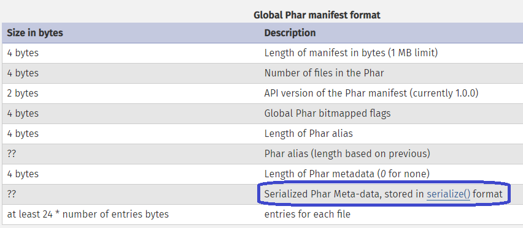

# Object Injection in phpMailer

## Object Injection

- PHP Object Injection là một lỗ hổng cấp ứng dụng có thể cho phép kẻ tấn công thực hiện các loại tấn công độc hại khác nhau, chẳng hạn như Code Injection , SQL Injection , Path Traversal và Application Denial of Service , tùy thuộc vào ngữ cảnh. 
- Lỗ hổng bảo mật xảy ra khi đầu vào do người dùng cung cấp không được làm sạch đúng cách trước khi được chuyển đến hàm unserialize() trong PHP. Vì PHP cho phép serialization đối tượng, những kẻ tấn công có thể chuyển các chuỗi được serialization đặc biệt đến một lệnh gọi unserialize() dễ bị tấn công, dẫn đến việc đưa các đối tượng PHP tùy ý vào ứng dụng.

- Để khai thác thành công lỗ hổng PHP Object Injection, hai điều kiện phải được đáp ứng:

	+ Ứng dụng phải có một lớp triển khai một magic method PHP (chẳng hạn như \_\_wakeup() hoặc \_\_destruct()) có thể được sử dụng để thực hiện các cuộc tấn công độc hại hoặc để bắt đầu một "POP chain".
	+ Tất cả các lớp được sử dụng trong cuộc tấn công phải được khai báo khi unserialize() được gọi.

### Magic method

- Magic method là phương thức đặc biệt ghi đè hành động mặc định của PHP khi một số hành động nhất định được thực hiện trên một đối tượng. Chúng được bắt đầu bằng hai dấu gach dưới ví dụ : \_\_sleep(), \_\_wakeup(), \_\_destruct(),...

- Trong php có rất nhiều magic method khác nhau dưới đây mình sẽ liệt kê ra các method quan trọng cần lưu ý:

1. **__construct()** : nó được gọi bất cứ khi nào một đối tượng của lớp được khởi tạo tương tự với __init__ trong python.

2. **__wakeup()** : được thực thi khi hàm unserialize được gọi, phương thức sẽ phục hồi lại đối tượng được lưu trong chuỗi trả về từ hàm serialize() , tương tự với readObject() trong java.

3. **__destruct()** : được gọi ở cuối khi hàm dừng hay trong một số trường hợp hàm bị hủy do lỗi.

4. **__sleep()** : thực hiện chức năng nào đó trước serialize(). Trả về một mảng với tên của tất cả các biến của đối tượng đó sẽ được serialize(). Nếu trả về null sẽ xuất hiệ lỗi E_NOTICE  khi serialize().

5. **__toString** : trả về object dưới dạng chuỗi nhưng cũng có thể được sử dụng để đọc tệp hoặc hơn thế nữa dựa trên lời gọi hàm bên trong nó.

6. **__invoke()** :  được gọi khi một tập lệnh cố gắng gọi một object dưới dạng một hàm.

### Gadget chain

- "Gadget" là một đoạn mã tồn tại trong ứng dụng có thể giúp kẻ tấn công đạt được một mục tiêu cụ thể. Một gadget riêng lẻ có thể không trực tiếp làm bất cứ điều gì có hại với thông tin người dùng nhập. Bằng cách xâu chuỗi nhiều gadget lại với nhau, kẻ tấn công có thể chuyển đầu vào của chúng vào một "sink gadget" nguy hiểm, nơi nó có thể gây ra thiệt hại tối đa.

- Gadget chains không phải là một payload kẻ tấn công xây dựng mà là các mã đã tồn tại trên trang web. Điều duy nhất mà kẻ tấn công kiểm soát là dữ liệu được chuyển vào gadget. Điều này thường được thực hiện bằng cách sử dụng một magic method là invoked, đôi khi được gọi là "kick-off gadget".

## phar deserialization

- Tương tự như các tệp lưu trữ Java (JAR), trong PHP, bạn có thể chia sẻ một thư viện hoặc toàn bộ ứng dụng dưới dạng một tệp duy nhất bằng cách sử dụng tệp PHAR (PHP  Archive).
- PHP cung cấp một số wrapper kiểu URL mà bạn có thể sử dụng để xử lý các giao thức khác nhau khi truy cập đường dẫn tệp. Một trong số đó là **phar://**, cung cấp giao diện luồng để truy cập các tệp *.phar*.

- Một file PHAR bao gồm 04 thành phần:
	1. Stub : đây là phần đầu tiên của PHAR, chứa mã nguồn chính và kết thúc bằng **__HALT_COMPILER()**.
	2. Manifest : chứa các metadata ở dạng serialized format, chúng sẽ tự động deserialized khi có bất cứ hoạt động nào của tệp PHAR được gọi bằng wapper *phar://*.
	3. File Contents : là các file tồn tại bên trong archive
	4. Signature : là một hàm băm của file archive, phải có chữ ký hợp lệ nếu muốn truy cập file archive từ PHP.

- Để có thể khai thác lỗ hổng phar deserialized cần 3 điều kiện sau:
	+ Tìm được POP chain trong trong source code cần khai thác.
	+ Đưa được Phar file vào đối tượng cần khai thác.
	+ Tìm các nơi mà filesystem function gọi tới các Phar file do người dùng kiểm soát.

- Các hàm file dễ ảnh hưởng bởi lỗ hổng này:

##  PHP Object Injection trong PHPMailer

- PHP Object Injection trong PHPMailer (CVE-2020-36326, CVE-2018-19296) xảy ra thông qua chức năng *addAttachment* với tên đường dẫn UNC, lỗ hổng này ảnh hưởng đến các phiên bản từ 3.7-5.7

- Lỗ hổng xảy ra bằng cách chuyển đường dẫn *phar://* vào hàm *addAttachment()*

- Khi so sánh bản lỗi và bản vá ta có thể nhận thấy PHPMailer thêm một kiểm tra isPeriledPath($path)
để kiểm tra xem đường dẫn có hợp lệ hay không, nếu không thì *phpmailerException* sẽ được gọi ra.

- Ta có thể thấy hàm *isPeriledPath* sẽ kiểm tra xem đường dẫn có chứa *://* hay không, điều này sẽ vô hiệu hóa cách sử dụng đường dẫn tệp thông qua các php wrapper hay nói rộng hơn nó từ chối cho phép người dùng truyền vào các đường dẫn dạng url.

- Trong khi ta có thể thấy trong phiên bản lỗi code chỉ kiểm tra xem đầu vào có phải là một tệp hay không thông qua hàm **is_file()**, như vậy nếu ta có thể tải lên server một tệp phar và kiểm soát đường dẫn tệp thì ta hoàn toàn có thể thực hiện một cuộc tấn công phar nhờ vào việc gọi file bằng *phar://path* thông qua hàm *addAttachment()*.

*Continue Update*