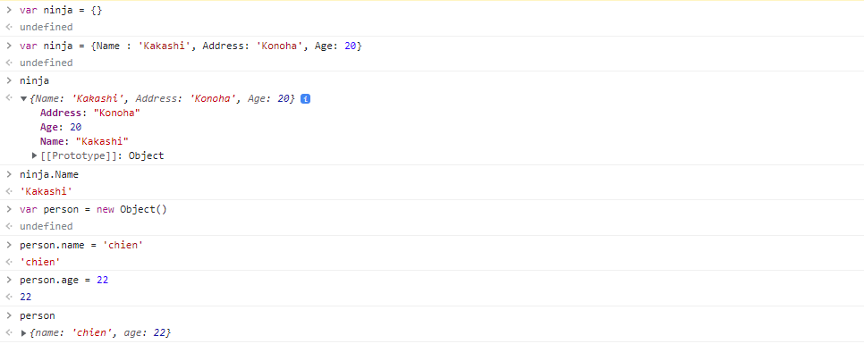
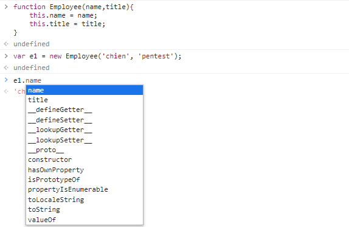
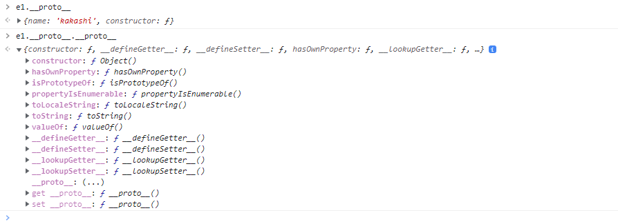
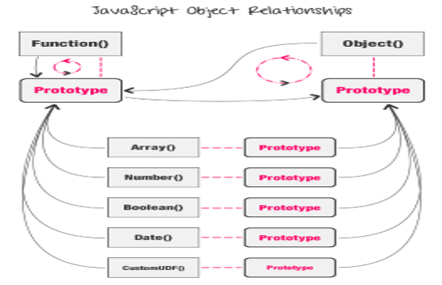
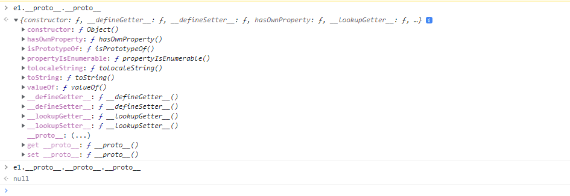
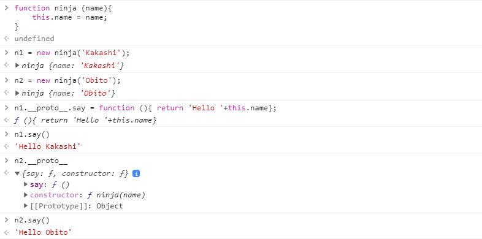
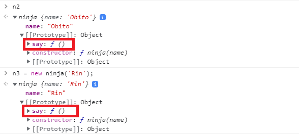
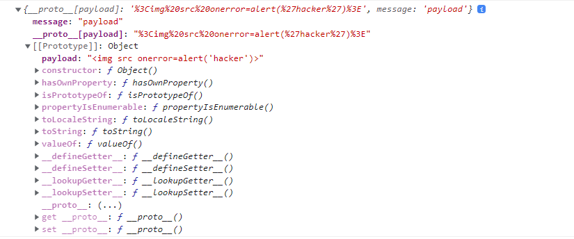
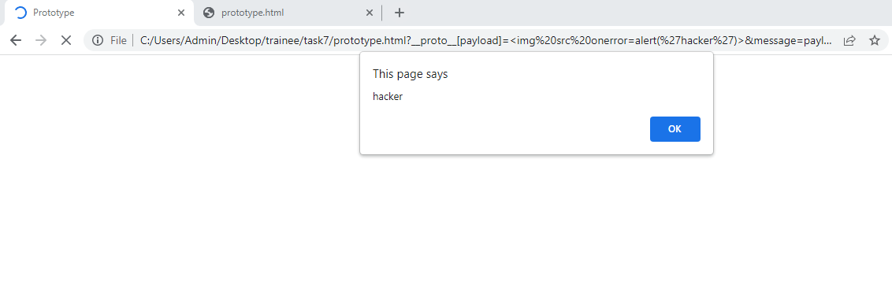

# Prototype pollution.

## Các khái niệm cơ bản.

### Objects

- Một Objects trong JavaScript là một kiểu dữ liệu bao gồm một tập hợp các giá trị và thuộc tính , được biểu diễn bằng các cặp *key:value*. Các cặp *key:value* bao gồm các thuộc tính có thể là bất kỳ kiểu dữ liệu nào.
- Ta có thể khai báo một object theo hai cách.
	+ Var a = new Object () => Đây được gọi là Object Constructor.
	+ Var a = {} => Đây được gọi là Object Literal.



=> Name, Address, Age là các thuộc tính (properties). Tương tự việc chúng ta truy cập các array bằng chỉ mục thì ta có thể truy cập vào objects thông qua thuộc tính.

```
// access properties in objects
ninja.Name
or
ninja['Name']
```

- Một objects có thể lưu trữ nhiều kiểu dữ liệu khác nhau như string, number, boolean, array, funtion.

```
var a = {
	firstName : 'Hatake',
	lastName : 'Kakashi',
	favorite : ['Dog','cat','sharing','knowledge'],
  	fullName : function{
  		return this.firstName + " " + this.lastName
  	} 
}
a.firstName
// Hatake
a.fullName()
//Hatake Kakashi
```
- Đến đấy ta có thể thấy việc gọi *firstName* và *fullName* có sự khác biệt là do *firstName* là một thuộc tính còn *fullName* là một phương thức.
	+ Thuộc tính là sự liên kết giữa key và value trong một Objects và nó có thể chứa bất kỳ kiểu dữ liệu nào.Một thuộc tính thường đề cập đến đặc tính của một đối tượng.
	+ Phương thức là một hàm giá trị của một thuộc tính đối tượng và do đó là một tác vụ mà một đối tượng có thể thực hiện.

- Ngoài ra, có thể thấy từ khóa **this** được sử dụng trong hàm của phương thức *fullName*, ta có thể hiểu nó là một thể hiện của một Object và đứng trong các ngữ cảnh khác nhau nó sẽ có giá trị khác nhau.
	+ Trong một phương thức đối tượng, *this* tham chiếu đến chính đối tượng đó.
	+ Khi đứng một mình , *this* đề cập đến đối tượng toàn cục.
	+ Trong một hàm, *this* tham chiếu đến đối tượng toàn cục.
	+ Trong một chức năng (strict mode) *this* là *undefined*.
	+ Trong một sự kiện, *this* đề cập đến phần tử đã nhận sự kiện.
	+ Các phương thức như call(), apply() và bind() có thể tham chiếu *this* đến bất kỳ đối tượng nào.

### Constructor

- **Constructor** trong JavaScript là một loại phương thức đặc biệt được sử dụng để khởi tạo và tạo một đối tượng. Nó được gọi khi bộ nhớ được cấp phát cho một đối tượng
- Khi constructor được khởi tạo bên trong một class nó sẽ tự động được gọi khi class chứa nó được gọi hay nói cách khác nó là hàm được gọi đầu tiên trong class.
- Constructor tương tự như tên lớp của nó, nhưng Constructor không có kiểu trả về.
- Một vài quy ước của hàm Constructor là:
	+ Tên object constructor nên bắt đầu bằng chữ hoa.
	+ Sử dụng từ khóa **this** để thiết lập các thuộc tính của đối tượng cần tạo.
	+ constructor xác định các thuộc tính và hành vi thay vì trả về một giá trị.
	+ **new** được sử dụng khi gọi một hàm construction.

- VD:
```
class ninja {
    constructor(name, address, skill) {
        this.name = name;
        this.address = address;
        this.skill = skill;
    }

    // Thêm vào các phương thức (method)
    action() {
        console.log(`${this.name} Action: Kill`)
    }
}

let kaka = new ninja('Kakashi', 'Konoha', 'Sharingan');

kaka.action() // Kakashi Action: Kill
```

### Prototypes

- Prototype là cơ chế mà các đối tượng JavaScript kế thừa các tính năng từ nhau, chúng ta có thể thêm nhiều thuộc tính trong Prototype.



- Như ta thấy khi nhấn dấu **.** trước *e1* ngoài hai thuộc tính 'name' và 'type' còn có thêm nhiều thuộc tính khác như :
```
__defineGetter__
__defineSetter__
__lookupGetter__
__lookupSetter__
__proto__
```
- Các thuộc tính tích hợp này được gọi là prototype. Prototype tự nó là một Object, vì vậy prototye cũng sẽ có các prototype riêng của chính nó, từ đó tạo ra cái gọi là prototype chain. Chuỗi kết thúc khi chúng ta truy cập đến prototype mà giá trị trả về là null.



- Điều này có nghĩa là bất cứ khi nào chúng ta tạo một hàm, JavaScript sẽ thêm một thuộc tính nội bộ bên trong hàm, nó còn được gọi là **Prototype Object**. Chúng ta có thể thêm vào các phương thức và thuộc tính để cho phép tất cả các đối tượng khác kế thừa các phương thức và thuộc tính này.

=> Tất cả các đối tượng JavaScript kế thừa các thuộc tính và phương thức từ một prototype.



- Dữ liệu được tìm kiếm trong prototype của đối tượng. Nếu nó không được tìm thấy trong prototype đó, thì nó sẽ đi vào các prototype của **prototype object**. Điều này tiếp tục cho đến khi dữ liệu được tìm thấy hoặc trả về *undefined*.

- *__proto__* là một cách để kế thừa các thuộc tính từ một đối tượng trong JavaScript. *__proto__* là một thuộc tính của Object.prototype để hiển thị [[Prototype]] của đối tượng mà nó được phép truy cập.



- Có thể thấy trong object, chúng ta sẽ không thấy phương thức *hasOwnProperty* khả dụng. Nhưng nó lại có sẵn trong *__proto__*, hay nói cách khác *hasOwnProperty* tồn tại trong chính *__proto__*. Ta có thể truy cập vào các prototype cấp sâu hơn bằng cách sử dụng nhiều *__proto__* và khi kết quả trả về null chuỗi kết thúc.

- Phân biệt *__proto__* và *prototype*:
	+ *__proto__* là đối tượng thực tế được sử dụng trong chuỗi tra cứu để giải quyết các phương thức.
	+ *prototype* là đối tượng được sử dụng để xây dựng *__proto__* khi chúng ta tạo một đối tượng.
=> Vì vậy, proto là đối tượng thực tế được lưu và sử dụng làm *prototype* trong khi *prototype* chỉ là bản thiết kế cho *__proto__*.

## Prototype Pollution là gì?

- Cuộc tấn công Prototype Pollution là một dạng tấn công (thêm/sửa/xóa thuộc tính) vào prototype object trong Javascript, dẫn đến các lỗi logic, đôi khi dẫn đến việc thực thi các đoạn mã tùy ý trên hệ thống (RCE).

- Đây là một lỗ hổng mà attacker có thể thay đổi thuộc tính của tất cả các đối tượng trong code JS dựa vào việc kiểm soát một đối tượng duy nhất bằng cách sử dụng *__proto__*.

- Cuộc tấn công này sẽ chỉ xảy ra khi có các điều kiện trên:
	+ Thực hiện việc ghép đệ quy các đối tượng (Object recursive merge).
	+ Định nghĩa thuộc tính qua đường dẫn (Property definition by path).
	+ Thực hiện nhân bản đối tượng (Clone object). 

- Mức độ gây hại của cuộc tấn công có thể phụ thuộc vào ứng dụng và payload, nó có thể gây ra các lỗ hổng nguy hiểm như RCE, IDOR, Bypass Auth và các lỗ hổng khác, hay thông dụng nhất là XSS.



- Từ ví dụ trên ta có thể thấy rằng khi ta tạo hai object hoàn toàn mới *n1* và *n2* từ *construction ninja* và sau đó ta sẽ thêm một phương thức mới là *say* cho *n1*. Theo logic phương thức này sẽ chỉ có trong *n1* tuy nhiên thay vì sử dụng *n1.prototype.say* để thêm thì ta dùng *n1.__proto__.say* để thêm điều này sẽ không chỉ thay đổi các phương thức bên trong *n1* mà nó làm thay đối tất cả phương thức của các đối tượng trong ứng dụng. Bằng chứng là object *n2* cũng tồn tại thuộc tính *say*.



- Như đã nói ở trên tuy *n2* không được thêm phương thức *say* tuy nhiên phương thức này lại được khai báo trong *__proto__* mà bất kì object nào cũng đều tồn tại *__proto__* bởi vậy khi chương trình không tìm thấy phương thức *say* trong object n2 nó sẽ tiếp tục đi xuống *__proto__* và tìm kiếm và tìm thấy say tại đây vì thế theo tính kế thừa *say* sẽ được gọi từ n2. Điều này không chỉ tác động đến các object có sẵn mà ngay cả khi tạo mới một object n3 nó cũng bị ảnh hưởng.

## Khai thác.

```
function getUrlVars() {
	var vars = {};
	var parts = window.location.href.replace(/[?&]+([^=&]+)=([^&]*)/gi,    
	function(m,key,value) {
		vars[key] = value;
	});
	return vars;
}
const query = {}; 
const params = getUrlVars();

for (let key in params) {
	const [k1, k2] = key.split('[').map(kn => kn.replace(']', ''));
	if (k2 == undefined){
		query[k1] = params[key];
	}else{
		query[k1][k2] = decodeURI(params[key]);
	}	
}

const messages = {
	error: "Error: something went wrong",
	success: "Everything worked as expected :)"
};

if (query.message != undefined){
	document.querySelector('#message').innerHTML = messages[query.message];
};
```

- Hàm *getUrlVars()* sẽ làm nhiệm vụ lấy các giá trị key và value mà ta truyền vào thông qua URL. Cụ thể ở đây nó được lưu trữ trong biến params.
- Object query sẽ được khởi tạo với mục đích để lưu trữ value từ message.
- Vòng for làm công việc phân tách các key , value để ghi vào object query .
- Tiếp theo là công việc đưa nội dung message ra màn hình bằng message[query.mesage] 

- Tuy nhiên nếu ta thêm một param có dạng *__proto__[payload]=malicious code&message=payload* và url thì chuyện gì sẽ xảy ra ?

- Thực tế object *messages* chỉ có hai thuộc tính là *error* và *success* và hoàn toàn không có thuộc tính tên là *payload* nên khi truyền vào *message=payload* nó sẽ trả về *undefine*.

- Nhưng vì ứng dụng thực hiện lấy và phân tích tất cả các param mà ta truyền vào nên ta hoàn toàn có thể lợi dụng điều này để thêm một thuộc tính payload vào bằng *__proto__*. Lúc này thuộc tính payload không phải tồn tại trong object message mà nó nằm trong object prototype. Như đã nói ở trên thì ứng dụng sẽ vào message và tìm kiếm payload do là không có payload nên nó sẽ tiếp tục đi xuống [[prototype]] để tìm kiếm và ở đây nó tìm thấy payload.



> Payload:

```
?__proto__[payload]=&message=payload
```

- Như vậy mặc dù không tồn tại thuộc tính payload trong messages nhưng ứng dụng vẫn gọi lên được và thực thi nó.

